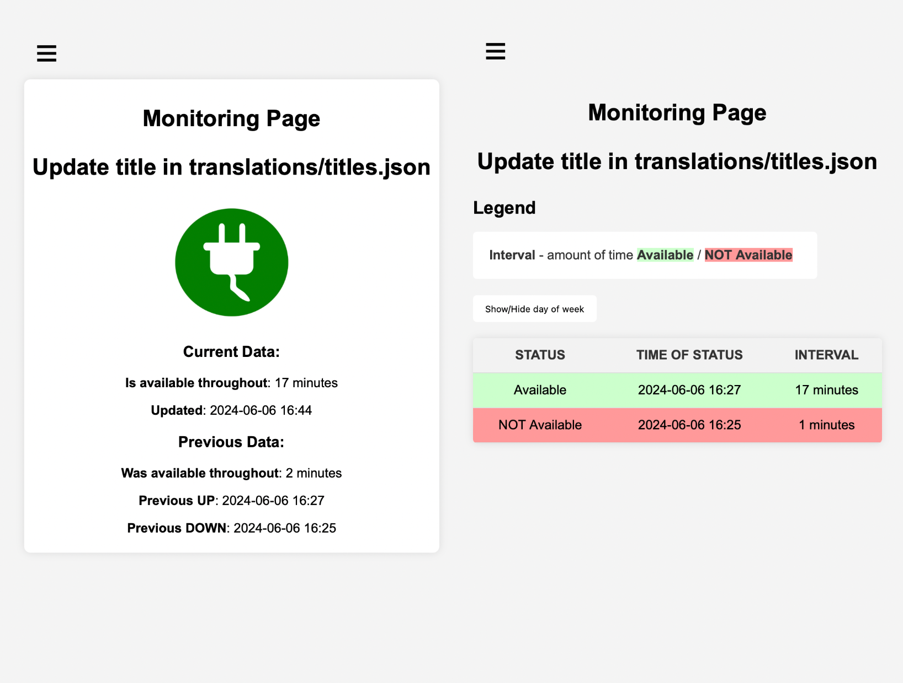

# is-it-up-app [ˈɪz ɪt ˈʌp æp]


This is a lightweight app, based on **FastAPI** for uplink monitoring with built in WebUI.

The database used is **SQLite**, which is generated on the first start of the app.

Checking logic is done similarly to **telnet**, but via **websocket**.



## Environment Variables

To run this project, you will need theese Environment Variables in **docker-compose.yaml** or just in system:

* `CHECK_HOST` - **host** or **ip** to service
* `CHECK_PORT` - **host** or **ip** to service
* `LANGUAGE` - **ENGLISH** or **UKRAINIAN**
[**Optional**]:
* `MODE` - if set **MAINTENANCE** all routes will respond with maintenance page


## Configuration

In addition to **environment variables**, a JSON file called '**translations/titles.json**' is used:

```json
{
    "title_1": "Monitoring Page",
    "title_2": "Update title in translations/titles.json"
}
```
## Run Locally

Clone the project

```bash
  git clone https://github.com/LancyX/is-it-up-app
```

Go to the project directory

```bash
  cd is-it-up-app
```

---
[**OPTION 1**]: Run in docker

To **start** app

```bash
  make start-docker
```

To **stop** app

```bash
  make stop-docker
```
---
[**OPTION 2**]: Run in python venv

Create **virtual env**

```bash
  python3 -m venv venv
```

Enable **venv**

```bash
  source/venv/bin/activate
```

Install **requirements**

```bash
  pip install -r requirements.txt
```

Allow execution

```bash
  chmod +x tools/run.sh
```

Start **app**

```bash
  ./tools/run.sh
```
---
### Access WebUI

[http://localhost:8000](http://localhost:8000)


