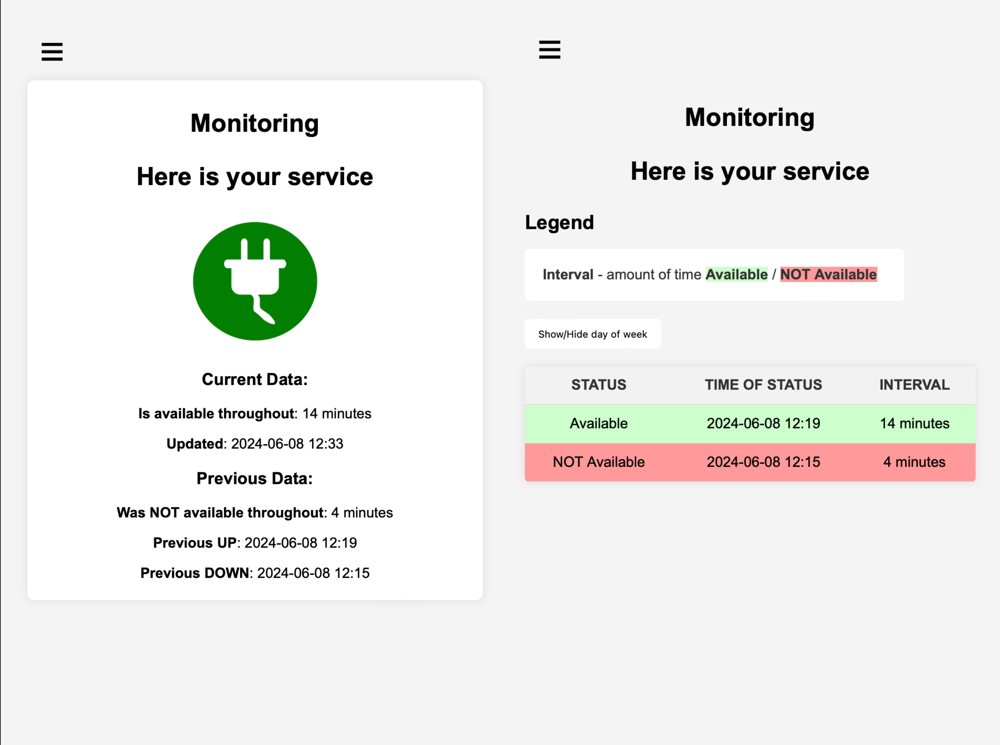

# is-it-up-app [ˈɪz ɪt ˈʌp ˈʌp]


This is a lightweight app, based on **FastAPI** for uplink monitoring with built in WebUI.

The database used is **SQLite**, which is generated on the first start of the app.

Checking logic is done similarly to **telnet**, but via **websocket**.



## Environment Variables

To run this project, you will need theese Environment Variables in **docker-compose.yaml** or just in system:

* `CHECK_HOST` - **host** or **ip** to service
* `CHECK_PORT` - **port** to service
* `LANGUAGE` - **ENGLISH** or **UKRAINIAN**
* `TITLE_1` - first **title** line
* `TITLE_2` - second **title** line
[**Optional**]:
* `MODE` - if set **MAINTENANCE** all routes will respond with maintenance page


## Run localy

[**Using docker run**]:

```bash
  docker run -d \
    --name is-it-up-app \
    -p 8000:8000 \
    -e CHECK_HOST=<host> \
    -e CHECK_PORT=<port> \
    -e LANGUAGE=ENGLISH \
    -e TITLE_1=Monitoring \
    -e TITLE_2=Here is your service \
    -v sqlite:/app/backend/ \
    --restart unless-stopped \
    lancyx/is-it-up-app:latest
```

[**Using docker-compose**]:

1. Download examples/docker-compose.yaml

2. Navigate to directory with docker-compose.yaml

3. Start app:

```bash
  docker compose up -d
```

or

```bash
  docker-compose up -d
```

## Run Locally from source

Clone the project

```bash
  git clone https://github.com/LancyX/is-it-up-app
```

Go to the project directory

```bash
  cd is-it-up-app
```

---
[**OPTION 1**]: Run in docker

To **start** app

```bash
  make start-docker
```

To **stop** app

```bash
  make stop-docker
```
---
[**OPTION 2**]: Run in python venv

Create **virtual env**

```bash
  python3 -m venv venv
```

Enable **venv**

```bash
  source/venv/bin/activate
```

Install **requirements**

```bash
  pip install -r requirements.txt
```

Allow execution

```bash
  chmod +x tools/run.sh
```

Start **app**

```bash
  ./tools/run.sh
```
---
### Access WebUI

[http://localhost:8000](http://localhost:8000)


## Usage/Examples

The **is-it-up-app** could be deployed by running as:
- Docker container
- Systemd service (example **.service** is available in **examples** )

Here are few use cases for **is-it-up-app**:

[**Power Monitoring**]

Monitoring the presence or absence of electricity at home, office or anywhere else.

- The **is-it-up-app** should be deployed on cloud server or any other environment that doesn't have power supply issues.
- In home, office, etc. -  should be device with some service running.

    **Example**:
    - nginx service ([how to set up](https://www.digitalocean.com/community/tutorials/how-to-install-nginx-on-ubuntu-20-04))
    - some smart devices (like Midea-compatible WiFi module)
    - WiFi router with [OpenWRT](https://openwrt.org/docs/guide-user/luci/luci.secure) (you can expose it's WebUI and therefore - connect with websocket) - if it does not have a backup power supply

[**MQTT Broker Monitoring**]

MQTT brokers could be accessible via websocket for a check.

 ```
 However, that's not the case for MQTT Brokers deployed on the Kubernetes Cluster (opened TCP ports will be accessible whether a broker is running or not)
 ```
